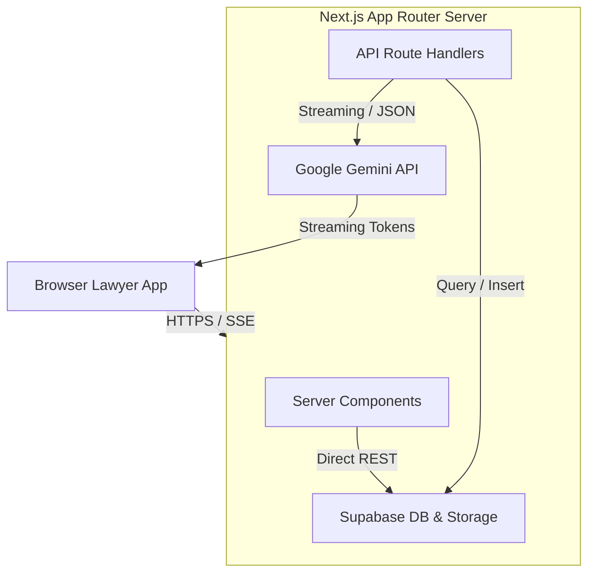

<div align="center">
  <h1>⚖️ LAWRIS</h1>
  <p><strong>AI-Native Case-Management Agent for Indian Advocates</strong></p>

  [](https://nextjs.org/)
  [](https://www.typescriptlang.org/)
  [](https://supabase.com/)
  [](https://aistudio.google.com/)
</div>

---

**Lawris** collapses four traditionally broken and disconnected legal workflows into a single unified workspace:
1. 📂 **Case & Document Management:** Seamlessly track clients, matters, documents, and hearing timelines.
2. 🧠 **Statutory Deadline Intelligence:** Automatically calculate critical deadlines (e.g., BNSS s.187(3) chargesheet rules, Limitation Act periods, hearing dates) from raw case data.
3. ✍️ **AI Document Drafting:** Generate court-ready, formatted bail applications and plaints in under 30 seconds using Gemini streaming.
4. 🔍 **Grounded Legal Research:** Run context-aware Q&A queries against both specific case documents and a shared, curated corpus of landmark Indian judgments and statutes.

---

## 🗺️ System Architecture

The entire application runs as a **single deployable unit (Next.js 14 App Router)**, optimizing communication latency between UI components and backend AI engines.



---

## 🚀 The Four Core Pillars

### 1. 🧠 Statutory Deadline Brain
Automatically extracts data from FIR logs to calculate critical deadlines and classifications based on the **Bharatiya Nagarik Suraksha Sanhita (BNSS), 2023** and **Code of Criminal Procedure (CrPC)**:
- **BNSS s.187(3) Rule:** Automatically registers a 60-day deadline if the offence's maximum sentence is < 10 years, and a 90-day deadline if it is $\ge$ 10 years.
- **Urgency Classification:** Dynamically groups and highlights deadlines by color-coded urgency pills:
  - 🔴 **Critical:** $\le$ 3 days remaining.
  - 🟡 **High:** $\le$ 7 days remaining.
  - 🟢 **Normal / Completed**
- *Implementation:* Defined in [`src/lib/deadlines.ts`](file:///d:/Ameya/Projects/lawris-main/src/lib/deadlines.ts) and surfaced dynamically in the Calendar dashboard.

### 2. ✍️ AI Document Drafting (Live Streaming)
Generates high-quality, court-ready templates based on strict Indian formatting standards:
- **Available Templates:** Regular Bail Applications (s.483 BNSS / s.439 CrPC) and Civil Plaints (Order VII CPC).
- **Interactive Editor:** Tokens stream straight from Gemini `gemini-2.5-flash` in real-time, instantly rendering Markdown into structured HTML in the document workspace.
- *Implementation:* Streaming pipeline managed in [`src/app/api/ai/draft/route.ts`](file:///d:/Ameya/Projects/lawris-main/src/app/api/ai/draft/route.ts) with templates in [`src/lib/prompts/bail-application.ts`](file:///d:/Ameya/Projects/lawris-main/src/lib/prompts/bail-application.ts).

### 3. 🔍 Case-Grounded Legal Research (RAG)
Avoids generic LLM hallucinations by restricting answers to verifiably real citations:
- **Two-Tier Search:** Checks local case documents and a **curated Indian legal corpus** containing 14 major sources (~761 chunks of statutes like BNS/BNSS/CPC and landmark Supreme Court judgments).
- **Hybrid Retrieval:** Employs stratified semantic search combined with keyword-boosted query optimization (prioritizing direct statute sections over judgment commentary).
- **Citations:** Structured output card yields core holdings, relevant facts, and dynamic external URLs verifying the laws directly on *Indiacode* or *IndianKanoon*.
- *Implementation:* Built in [`src/app/api/ai/research/route.ts`](file:///d:/Ameya/Projects/lawris-main/src/app/api/ai/research/route.ts) using [`src/lib/rag.ts`](file:///d:/Ameya/Projects/lawris-main/src/lib/rag.ts).

### 4. 📝 Hearing Memory & Auto-Summary
After logging a hearing, the case profile's `ai_summary` updates automatically:
- Reruns Gemini summarizing the entire cumulative hearing timeline in 4-8 crisp prose sentences.
- Auto-generates upcoming deadlines if a `next_date` or action is defined.
- *Implementation:* Located in [`src/app/api/cases/[id]/hearings/route.ts`](file:///d:/Ameya/Projects/lawris-main/src/app/api/cases/[id]/hearings/route.ts).

---

## 🗄️ Database & Schema Overview

The database utilizes **7 main tables** and **9 custom enums** to build a clean relation hierarchy where all entries cascade-delete under their parent objects.

```
 lawris-db
 ├── users (Bar Council registration, Lawyer profiles)
 ├── clients (Client details, Aadhar tokens)
 ├── cases (Case facts, BNS sections, arrest dates, summaries)
 ├── deadlines (Filing dates, urgency levels, completion states)
 ├── documents (System templates, uploaded PDFs, drafted files)
 ├── hearing_logs (Daily records of what transpired in court)
 └── research_notes (Case-specific AI research logs & citations)
```

> [!NOTE]
> Database schema definitions and DDL are stored in [`scripts/migrate.sql`](file:///d:/Ameya/Projects/lawris-main/scripts/migrate.sql) and mirrored as TypeScript interfaces in [`src/lib/types.ts`](file:///d:/Ameya/Projects/lawris-main/src/lib/types.ts).

---

## 🛠️ Installation & Setup

### Prerequisites
- Node.js version 20+
- A [Supabase](https://supabase.com/) instance (with custom SQL capabilities)
- A Google [Gemini AI API Key](https://aistudio.google.com/)

### Step 1: Clone & Install
```bash
git clone https://github.com/ameya-87/lawris.git
cd lawris
npm install
```

### Step 2: Configure Environment Variables
Create a `.env.local` file at the root of the project:
```env
GEMINI_API_KEY=your_gemini_api_key_here
GEMINI_MODEL_DRAFT=gemini-2.5-flash
GEMINI_MODEL_RESEARCH=gemini-2.5-flash-lite
GEMINI_MODEL_SUMMARISE=gemini-2.5-flash-lite

NEXT_PUBLIC_SUPABASE_URL=https://your-supabase-url.supabase.co
NEXT_PUBLIC_SUPABASE_ANON_KEY=your_supabase_anon_key
SUPABASE_SERVICE_ROLE_KEY=your_supabase_service_role_key

# Pin to the demo seeded lawyer (Adv. Priya Mehta)
LAWYER_ID=11111111-1111-1111-1111-111111111111
```

### Step 3: Populate Database Schema
1. Go to your **Supabase SQL Editor**.
2. Copy and execute [`scripts/migrate.sql`](file:///d:/Ameya/Projects/lawris-main/scripts/migrate.sql) to provision all tables and enum fields.
3. Open a new SQL query and execute [`scripts/seed.sql`](file:///d:/Ameya/Projects/lawris-main/scripts/seed.sql) to load test cases (including the demo POCSO matter).

### Step 4: Run Development Server
```bash
npm run dev
```
Open **[http://localhost:3000](http://localhost:3000)** in your browser.

---

## 🎯 Demo & Verification Checklist

To verify that the application is operating perfectly before showing it to users or judges:
1. **Health Check:** Send a GET request to `http://localhost:3000/api/health` and verify that the environment validation returns `"ok": true`.
2. **Interactive Sign-In:** Head to the `/sign-in` portal and log in using the credentials generated during database seeding.
3. **Deadlines Badge:** On the dashboard, ensure the POCSO Case shows a **red critical deadline badge** ("in 2 days") computed automatically from its maximum penalty and arrest date.
4. **Interactive Drafting:** Open the POCSO case page, click **"Draft Bail Application"**, and observe the draft stream tokens rendering within 5 seconds.
5. **Dynamic Precedents:** Ensure the generated bail document references *Satender Kumar Antil* and cites Article 21.
6. **Hearing logs:** Create a new hearing log and check if the AI summary block refreshes with the updated narrative instantly.

---

## 🔮 Future Roadmap

- 🔒 **Multi-user RLS Protection:** Isolate case workspaces based on Supabase Role-Based Access Control (RLS).
- 📂 **OCR & PDF Parser:** Integrate Tesseract.js/Google Cloud Vision to extract structural data from scanned PDF orders.
- 📡 **IndianKanoon Live Verification:** Connect directly with IndianKanoon APIs to fetch live, verified citations.
- 📄 **Export Formats:** Add native downloads for PDF and editable DOCX formats.
- 🗣️ **Voice-to-Text Logs:** Allow advocates to record audio case summaries which are automatically converted to written hearing logs.
