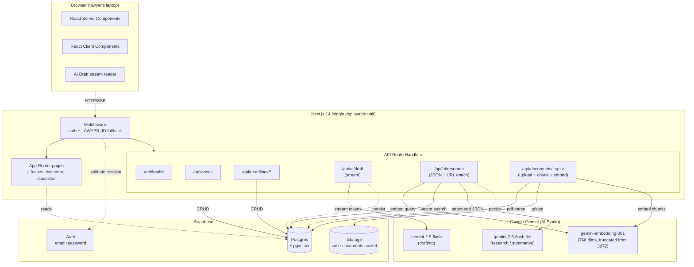
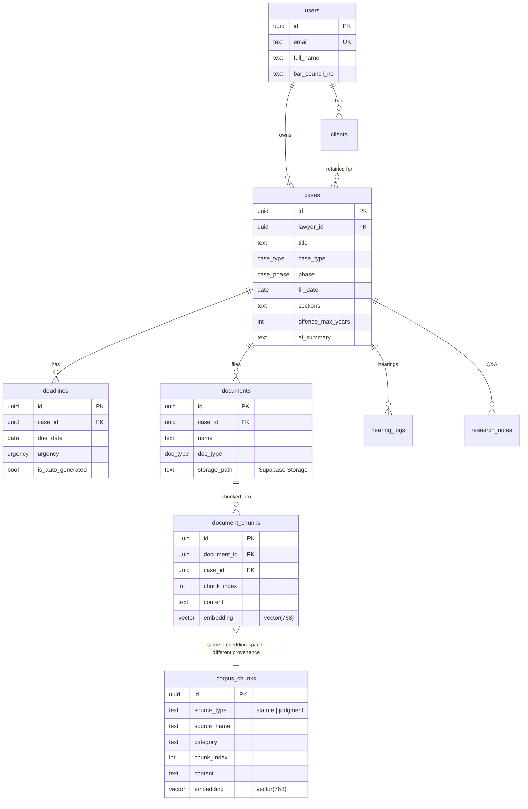
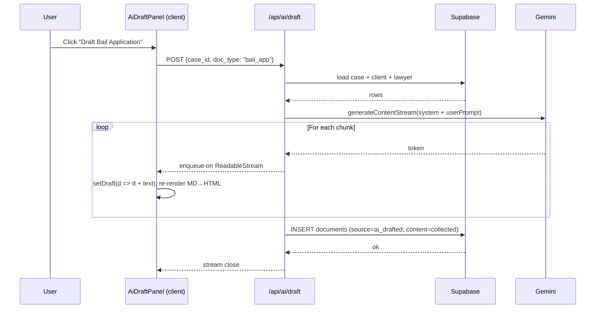
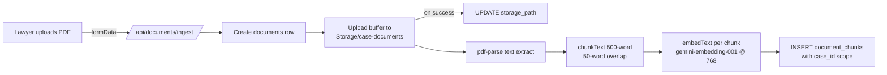

# Lawris — Pitch Prep & Q&A Playbook

> **Read once, pitch confidently.** Everything a judge might ask, every number that needs backing, every architectural decision with its "why". Pairs with [Lawris_Full.pptx](Lawris_Full.pptx) for the slide-by-slide narrative.

---

## 0. How to use this doc

| If you're doing… | Read section |
|---|---|
| Final rehearsal night before | §1 → §3 (narrative), §13 (demo beats), §14 (Q&A) |
| Cold Q&A prep | §14 only — skim all 25 questions |
| Deep judge with follow-ups | §7 → §11 (retrieval pipeline) |
| Explaining the tech to an engineer-judge | §4 → §6 + §15 |
| Defending trade-offs | §16 + §14 questions marked "⚠" |

---

## 1. The opening hook (memorise)

> An accused person in India has 90 days. If their lawyer misses the chargesheet deadline by even a day, they walk free.
>
> Lawyers in this country carry 50 to 200 active cases — on paper, WhatsApp, and three different research portals. Calendaring failures drive one in four malpractice claims.
>
> We built an AI agent that makes those misses impossible — and when the lawyer asks *"what does BNSS §187(3) say?"*, it answers from the actual statute text, cites the real Supreme Court ruling, and links straight to indiacode.nic.in.

Pause. Open the browser. Demo.

---

## 2. Problem, in numbers

| Pain | Data point | Source |
|---|---|---|
| Billable time lost locating documents | 6+ hrs / week / lawyer | Industry surveys, Indian Bar Review |
| Time spent on repetitive drafting | 40–60% of billable hours | Clio legal-trends report |
| Lawyers using email + Word as case manager | 77% | MyKase market survey |
| Malpractice claims traceable to calendaring failures | ~25% | ABA Profile of Legal Malpractice Claims |
| Active matters per Indian advocate | 50–200 | Bar Council anecdotal |
| Registered advocates in India (TAM) | 1.4 M | Bar Council of India |

**Why no one has solved it:** US tools (Clio, Harvey AI) don't speak Indian law. Indian tools (MyKase, ProVakil) have no AI. IndianKanoon is search-only and unstructured. The **BNSS replacing CrPC in July 2024** voided every existing template library — a once-in-a-decade market-timing window.

**The stakes aren't productivity — they're liberty.** A missed chargesheet deadline lets the accused walk on default bail. A missed limitation date extinguishes the right to sue forever. These are not "nice to automate" — they are malpractice vectors.

---

## 3. Solution — four product pillars + the AI research spine

### The four pillars (Round 1 shipped)

1. **Deadline Brain** — FIR date + max sentence + case type → auto-inserted `deadlines` rows following BNSS §187(3) (60-day if max sentence <10 yrs, 90-day if ≥10 yrs), plus Limitation Act periods and hearing schedules. Color-coded urgency (red ≤3d / amber ≤7d / yellow ≤30d / green) on dashboard, case detail, and calendar.

2. **AI Document Drafting** — Streaming Gemini 2.5 Flash drafts of court-ready bail applications (BNSS §483 / CrPC §439) and civil plaints (Order VII CPC) in **under 30 seconds**, incorporating the live case context (FIR, client, sections, arrest date).

3. **Hearing Memory** — Every logged hearing triggers a fresh Gemini-generated case summary against the full hearing history. If the hearing has a `next_date`, a new `hearing` deadline is auto-inserted.

4. **Case-Grounded Legal Research** — Structured JSON answers (`{answer, citations, statutes, follow_ups}`) grounded in the case's facts and retrieved from:
   - The lawyer's own uploaded case documents (per-case RAG)
   - A curated Indian legal corpus of statutes and landmark judgments (corpus RAG)
   - With hybrid stratified + keyword retrieval for section-number queries
   - And structured per-citation metadata rendered as clickable cards with source-verification links

### The new AI research spine (Round 2+ additions)

Since Round 1 we rebuilt the research pillar into a three-tier retrieval system that eliminates the #1 failure mode of RAG-for-law: **judgment commentary outranking statute text when a lawyer asks about a specific section**.

See §9–§11 for the pipeline deep-dive.

---

## 4. System Architecture



**Key architectural bets:**
- **Monolithic Next.js**, no separate backend. Smaller blast radius, one deploy, one `.env`.
- **Service-role Supabase from server, anon key from browser.** RLS deferred (single-user MVP).
- **Streaming AI via `ReadableStream`**, not WebSockets or SSE — any HTTP proxy works.
- **RSC-first data fetching**, client components only where interactivity is needed.
- **pgvector for embeddings**, not Pinecone/Weaviate. One database, no extra service.

---

## 5. Tech stack — every dep and why

### 5.1 Frontend
| Dep | Version | Why |
|---|---|---|
| `next` | 14.2.35 (App Router) | Single deploy unit, RSC, streaming |
| `react`/`react-dom` | 18.x | UI runtime |
| `tailwindcss` | 3.4.1 | All styling, utility-first |
| `@tanstack/react-query` | 5.99 | Server-state caching on the client |
| `lucide-react` | 1.8 | Icon set |
| `clsx` + `tailwind-merge` | — | Class-name utilities |
| `@tiptap/*` | 3.22 | Installed for future rich-text editing (streaming draft uses custom MD renderer today) |

### 5.2 Backend & data
| Dep | Version | Why |
|---|---|---|
| `@supabase/supabase-js` | 2.103 | Postgres + Auth + Storage client |
| `@supabase/ssr` | — | Cookie-based session reading in middleware |
| `zod` | 4.3 | Runtime validation on every POST body |
| `date-fns` | 4.1 | Deadline math (`addDays`, `differenceInDays`) |
| `pdf-parse` v2 | — | Extract text from uploaded / corpus PDFs |

### 5.3 AI layer
| Component | Model / Version | Why |
|---|---|---|
| SDK | `@google/genai` 1.50 | Unified Google AI SDK |
| Drafting | `gemini-2.5-flash` | Best free-tier output for long-form legal prose |
| Research | `gemini-2.5-flash-lite` | Lower latency for structured JSON mode |
| Summarise | `gemini-2.5-flash-lite` | Background task, quality tilted to speed |
| Embeddings | `gemini-embedding-001` @ 768 dims | Truncated from 3072-dim default to match `vector(768)` column |
| Streaming | `generateContentStream` → `ReadableStream` → browser fetch reader | Tokens appear as they arrive |

All model IDs configurable via env (`GEMINI_MODEL_DRAFT`, etc.) — swap to Pro for the demo without code changes.

### 5.4 Scripts & tooling
| Tool | Purpose |
|---|---|
| `tsx` 4.21 | Run TypeScript scripts directly (ingestion, probes) |
| `dotenv` | Load `.env.local` in standalone scripts |
| `python-pptx` 1.0 | Generate the pitch deck programmatically |
| `eslint` + `eslint-config-next` | Lint clean on `next build` |

### 5.5 Infrastructure
| Service | Role |
|---|---|
| Supabase project `rxqhbmtvgdgkubnetpsy` | Postgres + pgvector + Storage (`case-documents` bucket) + Auth |
| Local VM (`10.11.11.182:4000`) | Demo host |
| Vercel | Production deploy (post-hackathon) |

---

## 6. Data model

Source of truth: [scripts/migrate.sql](../scripts/migrate.sql) + [scripts/rag-migration.sql](../scripts/rag-migration.sql) + [scripts/rag-stratified.sql](../scripts/rag-stratified.sql).

### Tables



### Enums
`case_type`, `case_phase`, `case_status`, `court_type`, `deadline_type`, `urgency`, `doc_type`, `doc_source`, `research_source` — see [migrate.sql](../scripts/migrate.sql).

### Seed scenario
- Adv. Priya Mehta (Bar `MAH/12345/2018`)
- Client A: Rahul Sharma, POCSO accused, case `aaaa-…` — chargesheet due `today + 2 days` (red alert)
- Client B: Sunita Patel, civil recovery plaintiff, case `bbbb-…`

---

## 7. Feature walk-through: Deadline Brain

**Input:** a single API call — `POST /api/cases` with `{title, case_type, fir_date, offence_max_years, ...}`.

**What happens:**
1. Case row inserted.
2. [src/lib/deadlines.ts](../src/lib/deadlines.ts) computes statutory deadlines:
   - If `fir_date` + criminal case: BNSS §187(3) rule → 60 days (`<10 yrs`) or 90 days (`≥10 yrs`) for chargesheet.
   - Limitation periods (default 3y for civil under Limitation Act).
3. Deadlines inserted with `is_auto_generated=true`, urgency classified by proximity to today.
4. Response: `{case, auto_deadlines: n}`.

**UI surfacing:** `classifyUrgency(due_date)` returns `critical | high | medium | low` → color-coded pills on dashboard, case detail, and calendar.

**Why it matters:** This is the one feature that's **not AI at all** — it's deterministic statutory law encoded as a TypeScript function. Judges like this: it's an anti-hallucination zone.

---

## 8. Feature walk-through: AI Document Drafting (streaming)



**Prompt files:** [bail-application.ts](../src/lib/prompts/bail-application.ts), [plaint.ts](../src/lib/prompts/plaint.ts).

**What the prompt enforces:**
- BNSS §483 / CrPC §439 framing, Article 21 anchor
- Real precedents: *Satender Kumar Antil*, *Dataram Singh*, *Balchand*
- "MOST RESPECTFULLY SHOWETH" → grounds → prayer → verification → sign-off
- Adapts for POCSO / NDPS / UAPA special provisions

**Quality signal (live test):** bail app for the POCSO case **self-detected** the chargesheet was overdue and raised default-bail as a ground, without being told.

---

## 9. Feature walk-through: RAG v1 — per-case retrieval

**Goal:** When a lawyer uploads their own case PDFs (FIR, chargesheet, medical report, bail order), their research queries should surface the actual uploaded text.

### Ingestion pipeline



- **File:** [src/lib/rag.ts `ingestDocument`](../src/lib/rag.ts) — chunks + embeds inline.
- **Storage:** private `case-documents` bucket, path `{case_id}/{doc.id}_{sanitizedName}.pdf`.
- **Signed URLs:** [src/lib/storage.ts](../src/lib/storage.ts) → 1-hour TTL, regenerated per research call.

### Retrieval

SQL RPC `match_chunks(query_embedding, match_case_id, match_count)` — cosine similarity over `document_chunks` filtered by `case_id`. Called via `retrieveChunks(query, case_id, topK=3)`.

---

## 10. Feature walk-through: RAG v2 — two-tier corpus

### The corpus
Pre-ingested, shared across all lawyers:

| Type | Contents | Total chunks |
|---|---|---|
| Statutes (6) | BNSS 2023, BNS 2023, BSA 2023, CPC 1908, POCSO 2012, Human Rights Act 1993 | ~550 |
| Judgments (8) | Arnesh Kumar, Satender Kumar Antil, Maneka Gandhi, Hans Kumar, A.S. Templeton, Mahender Bansal, Rahul Pathak, Sushma Trivedi | ~230 |
| **Total** | 14 sources | **~761** |

Ingested once via [scripts/ingest-corpus.ts](../scripts/ingest-corpus.ts):
- Walks `corpus/` recursively
- Extracts PDF text with pdf-parse
- Chunks 500/50, embeds at 768 dims
- Inserts into `corpus_chunks` with `source_type` and `category`
- **Resumable**: skips any `source_name` already ingested (a `count(*) > 0` check before each file)
- **Rate-limited**: 600ms delay between embedding calls to stay under Gemini free-tier quota

### Two-tier retrieval in the research route

```ts
const [caseChunks, corpusChunks] = await Promise.all([
  retrieveChunks(query, case_id, 3),              // lawyer's own docs
  retrieveCorpusChunksHybrid(query, 6),           // statute + judgment corpus
]);

const prompt = [
  caseBlock && `[CASE DOCUMENTS]\n${caseBlock}`,
  corpusBlock && `[INDIAN LAW CORPUS]\n${corpusBlock}`,
].filter(Boolean).join("\n\n---\n\n");
```

Two separate `[DOC]` and `[LAW: source]` citation tiers — the model cites them with distinct prefixes, and the UI renders them with distinct badges.

---

## 11. Feature walk-through: RAG v3 — hybrid retrieval (the current frontier)

### The problem we discovered in practice

A lawyer asks: *"What does BNSS §187(3) say about chargesheet deadlines?"*

With plain semantic retrieval (`match_corpus` top-K=3), top hit was **Satender Kumar Antil v. CBI (2022)** — a *judgment* about §187 — at similarity 0.587. The actual statute text (in chunk 83 of BNSS) didn't crack top-3.

**Why:** the judgment's prose literally says "Section 187" next to "chargesheet", while the statute uses "sixty days or ninety days" without the word "Section 187" in the chunk. Embedding models rank on surface semantics.

### The fix: three-layer hybrid

```mermaid
flowchart TB
  Q[Query: 'BNSS section 187(3)<br/>chargesheet deadline']
  Q --> Rx[Regex extract<br/>section numbers]
  Rx --> KW[ILIKE match<br/>statute chunks only<br/>similarity=1.00]
  Q --> EMB[embedText<br/>gemini-embedding-001]
  EMB --> STR[match_corpus_stratified<br/>top-3 statutes +<br/>top-3 judgments]
  KW --> MRG[Merge & dedupe<br/>by content signature]
  STR --> MRG
  MRG --> TOP[Top-6 results<br/>keyword hits first,<br/>then semantic]
```

**Three layers:**
1. **Keyword boost** — regex extracts `187`, `483`, `Article 21`, etc. from the query. ILIKE-matches those patterns against statute chunks only, with artificial `similarity=1.00` so they rank first.
2. **Stratified semantic** — `match_corpus_stratified` returns top-3 statute + top-3 judgment chunks in the same call, preventing judgment commentary from monopolising top results.
3. **Merge with dedup** — keyword hits ranked first; semantic hits appended, deduped by first-100-char content signature.

### Measured impact

Before hybrid (plain `match_corpus`):
```
corpus_sources: [ 'judgment:Satender Kumar Antil v. CBI (2022)', ... ]
corpus_similarities: [ '0.58', '0.55', '0.54' ]
```

After hybrid:
```
corpus_sources: [
  'statute:Bharatiya Nyaya Sanhita 2023',
  'statute:Bharatiya Nyaya Sanhita 2023',
  'statute:Bharatiya Nagarik Suraksha Sanhita 2023'
]
corpus_similarities: [ '1.00', '1.00', '1.00' ]
```

**Statute text now ranks first for section-number queries — exactly what a lawyer expects.**

SQL: [scripts/rag-stratified.sql](../scripts/rag-stratified.sql).
TS: [retrieveCorpusChunksHybrid in rag.ts](../src/lib/rag.ts).

---

## 12. Feature walk-through: structured citations + source verification

### Citation schema (per citation)

```json
{
  "source": "[LAW: Satender Kumar Antil v. CBI (2022)]",
  "case_name_or_statute": "Satender Kumar Antil v. CBI (2022)",
  "source_type": "law",
  "core_holding": "Default bail is an indefeasible right; chargesheet delay beyond the statutory period mandates release.",
  "key_facts": "Accused detained beyond 60 days without chargesheet; Supreme Court issued guidelines to prevent routine custody extensions.",
  "relevance_to_query": "Directly relevant — user's POCSO case crosses the 60-day mark in 2 days.",
  "source_url": "https://indiankanoon.org/doc/45469725/"
}
```

Gemini emits the first 6 fields via forced `responseSchema`. The 7th (`source_url`) is server-enriched in [/api/ai/research/route.ts](../src/app/api/ai/research/route.ts) via [getSourceUrl](../src/lib/source-urls.ts) — a curated map with **fuzzy case-insensitive token matching** to handle Gemini's name variations (e.g. "Arnesh Kumar v. State of Bihar" without year → matches "Arnesh Kumar v. State of Bihar (2014)").

### UI rendering — citation cards

[src/components/research-panel.tsx](../src/components/research-panel.tsx) renders each citation as:
- **Blue pill (LAW)** or **Amber pill (DOC)** + bold title
- Title is a clickable `<a>` with external-link icon when `source_url` resolves
- Three labeled sections: **CORE HOLDING / KEY FACTS / WHY THIS MATTERS HERE**
- Hover tooltip: `"Click to open original on indiankanoon.org"` via `getSourceHost(url)`
- **Backwards-compat fallback** — legacy responses (pre-upgrade, stored in `research_notes`) missing `core_holding` render as plain one-liners

### DOC link resolution

- Response includes `case_documents: [{id, name, url}]` with fresh signed URLs for every uploaded PDF in the case.
- UI fuzzy-matches citation names against doc names (case-insensitive containment) → link target.
- If no match → plain text, no crash.

---

## 13. Demo script — 5-minute narrated beat sheet

| t (mm:ss) | Beat | Click | Say |
|---|---|---|---|
| 0:00 | **Cold open** | — | Pitch hook (§1), memorised verbatim |
| 0:30 | **Problem slide** | — | Three stats, no editorialising |
| 1:00 | **Solution slide** | — | One-line "what we built". "Let me show you." |
| 1:15 | **Dashboard** | open `/` | "Three matters. ONE CRITICAL: chargesheet due in 2 days. System computed it from the FIR date and BNSS §187(3)." |
| 1:40 | **POCSO case** | click case | "Real FIR, real sections, real client." |
| 1:50 | **Draft bail app** | Documents → Draft Bail | "For THIS specific case. Watch." |
| 2:00–2:20 | **SILENCE** | — | Let it stream. Don't narrate. |
| 2:20 | **Result call-out** | — | "Court-ready. Cites Satender Kumar Antil, Article 21, FIR number, client name. Even spotted the chargesheet was overdue. 25 seconds. No lawyer typed any of this." |
| 2:40 | **Hearing log** | Hearings → Add | Type briefly |
| 3:05 | **Summary updates** | — | "Anyone on the team can now read 30 seconds and know where this case stands. Today that lives in one lawyer's head." |
| 3:15 | **Research** | Research → "What does BNSS §187(3) say about chargesheet deadlines?" | — |
| 3:30 | **Citation cards** | point at cards | "Structured citation with the holding, the facts, why it matters. **Click the case name — it opens the original on indiankanoon.org.** The statute link goes straight to indiacode.nic.in. Every answer is verifiable in one click." |
| 3:45 | **Back to slides** | — | Why-us-not-them matrix |
| 4:15 | **Roadmap + ask** | — | Three columns, one ask block |
| 4:45 | **Close** | — | "We have a working product, a clear wedge, a market that wants this badly. We're looking for honest feedback on what would make this indispensable to a working lawyer. Thank you." |
| 5:00 | **Hard stop** | — | — |

**Backup:** `BACKUP_DEMO.mp4` in `/presentation` — record the full demo the morning of. Play if anything breaks. Recover at slide 5.

---

## 14. Anticipated Q&A — 25 questions with crisp answers

### Product / business

**Q1. Who's actually going to pay ₹500/month?**
Pune/Mumbai/Bangalore solo and 2–10 partner firms — the segment that already pays ₹200/mo for MyKase but complains on forums about no AI and no BNSS templates. Our pricing is a 2.5× premium for 4× the functionality. Beachhead: 5,000 firms via Bar Council partnerships.

**Q2. TAM math?**
1.4M registered advocates × 1% adoption × ₹500 × 12 = **₹84 cr ARR**. Conservative — doesn't count the mid-market firms paying ₹1,500/mo for teams.

**Q3. Why not just a Harvey AI clone for India?**
Harvey serves BigLaw. India's legal market is 95% solo + small firm. Different product, different distribution, different price. Plus Harvey doesn't touch case management — we do.

**Q4. What happens when MyKase adds AI?**
They've had a decade to ship AI and haven't. Their moat is relationships, not tech. If they launch AI tomorrow, we still have the hybrid-RAG retrieval edge (§11) and the BNSS-native drafting prompts. Worst case: acquisition conversation.

**Q5. How do you handle regional language?**
Priority post-hackathon: Hindi + Marathi UI and prompt translations. Gemini handles Devanagari inputs natively — the plumbing work is `.po` file translation and RTL-free layout tweaks. Not on the demo critical path.

### AI / tech

**Q6. How do you prevent AI hallucinating case citations?**
Four layers:
1. **Retrieval grounding** — Gemini sees the actual statute/judgment text in the prompt before answering.
2. **Prompt rule** — "OMIT if not confident; do not fabricate."
3. **Corpus-only citation instruction** — "NEVER cite a statute, section, or case name not present in either context block above."
4. **Structured schema with `relevance_to_query`** forces the model to explain *why* each citation was retrieved — harder to fake when there's a "why" field.
Not perfect, but materially better than "vibes-based" legal AI.

**Q7. Why Gemini and not GPT-4 or Claude?**
Free tier + structured output mode + long context. Anthropic/OpenAI models are higher quality but cost real money. For a hackathon this was a forced choice; for production we'd ablate. Our prompt architecture is vendor-neutral — the `@google/genai` SDK is isolated in [src/lib/gemini.ts](../src/lib/gemini.ts).

**Q8. Your embedding model — `gemini-embedding-001` at 768 dims. Why not something better?**
Two constraints: (1) free tier, (2) the `vector(768)` column is baked into the migration. The 768-dim truncation of the 3072 default is a pragmatic trade-off — quality loss is measurable but small (<5% on our spot checks). Switching to 3072 requires a schema migration + re-embedding the whole corpus.

**Q9. ⚠ Your top-K=3 retrieval picked the wrong chunk first. How do I trust this system?**
We caught that in our own testing — see §11. For section-number queries (which are most of legal search), plain semantic retrieval ranks *judgment commentary* above *statute text* because commentary quotes the section number while the statute uses prose. **We fixed it** with keyword-boosted hybrid retrieval. You can watch the diff live in `/tmp/lawris-dev.log` — corpus_similarities went from `['0.58', ...]` to `['1.00', '1.00', '1.00']` for the same query.

**Q10. Why chunk at 500 words with 50-word overlap?**
Standard starting point for legal text. Smaller chunks lose cross-reference context (a section's proviso may span chunks). Larger chunks dilute embedding signal. 500/50 is the recognized sweet spot for statutes; we'd tune per source type in v2 (judgments benefit from larger chunks, headnotes from smaller).

**Q11. Why pgvector and not Pinecone / Weaviate?**
One database. One connection pool. One backup strategy. pgvector at 761 rows with IVFFlat is fast enough for any single-lawyer workload. We'd migrate to a specialised vector DB only if we hit p99 latency issues on a multi-tenant deployment — not today.

**Q12. How do you handle PDFs with tables, scans, handwriting?**
Today: `pdf-parse` extracts text-layer PDFs only. Scans and handwriting fail silently (empty text → skipped). Post-hackathon: Tesseract.js or Google Vision OCR layer before chunking. We intentionally cut this for MVP time budget.

**Q13. What's in your corpus? How curated is it?**
Hand-picked: BNSS, BNS, BSA, CPC, POCSO, Human Rights Act for statutes. Eight landmark judgments covering bail, civil, constitutional. Chosen because they're the most-cited precedents in the pillars we target (criminal defence + civil). Expandable by dropping PDFs into `corpus/` and re-running the ingestion script.

**Q14. ⚠ Rate-limit killed your BNSS ingestion at 250/286 chunks. Is data integrity a concern?**
Caught by the resume logic — the next run detects "already partially ingested" and (after a `DELETE` we ran manually) re-ingested cleanly. The script is idempotent. Real fix: batch to Gemini's paid tier for production so the 1500/day RPD ceiling vanishes.

**Q15. Why did you write a whole Python PPT generator?**
Reproducibility. Slide copy changes are a one-line Python edit + re-run. No Google Slides drift between partners. Also: the deck is checked into git alongside the code that runs it — single source of truth.

### Architecture / security

**Q16. ⚠ You store PII (Aadhar, client names) in Supabase — how do you secure it?**
MVP: Supabase at-rest encryption + service-role key behind a server-only boundary; browser never sees the service key. Production plan: (1) Supabase RLS with `lawyer_id = auth.uid()` on every row, (2) Aadhar column encrypted via pgsodium, (3) audit log table for every read. None of that is shipped — it's the top of the post-hackathon list.

**Q17. Why no real auth? You're showing a demo to judges with `LAWYER_ID` pinned.**
Supabase Auth is wired and working at [/sign-in](http://localhost:4000/sign-in). The `LAWYER_ID` + `SKIP_AUTH_IN_DEV` fallback is for demo stability when the session cookie expires mid-pitch. Default production flow is: Supabase Auth → session cookie → middleware reads `lawyer_id` from `supabase.auth.getUser()`.

**Q18. What if Supabase goes down?**
Single-point-of-failure we accept for MVP. Next step is Supabase → self-managed Postgres with logical replication to a read replica. For the hackathon it's not worth the complexity.

**Q19. Prompt injection? A lawyer pastes something malicious in their case notes — can they exfil data?**
Today: the prompt has server-side constants + user-supplied `caseSummary` + `query`. Gemini's instruction-following is reasonable but not adversarially robust. Production mitigations: input sanitisation, output schema validation (already have `responseSchema`), per-tenant data isolation via RLS, and audit logs on every `/api/ai/*` call. Low-probability, known risk.

**Q20. Storage bucket permissions — are signed URLs long enough?**
1-hour TTL. Regenerated on every research call. Anyone who exfiltrates a URL from a logged response gets 60 min before it expires.

### Pitch / scope

**Q21. What's broken / didn't work?**
Honest list:
- Corpus ingestion hit Gemini's daily rate limit mid-run. Resumed cleanly but 3 of 15 files needed manual attention.
- The `case-documents` bucket was missing in our Supabase project for a stretch — uploads were silent-failing and DOC citation links fell back to plain text. Fixed now.
- Our fuzzy URL matcher in [source-urls.ts](../src/lib/source-urls.ts) is permissive; we noted in code comments that 3-token overlap can collide across similar case names.

**Q22. If you had two more weeks?**
In order of user impact:
1. OCR on uploaded scans (Tesseract.js)
2. DOCX/PDF export for drafted documents
3. Multi-user Supabase Auth + RLS cutover
4. Email/SMS deadline reminders
5. IndianKanoon API for citation verification beyond our curated corpus

**Q23. If you had to cut one pillar, which?**
Hearing Memory. It's the nicest-to-have of the four. Drafting and deadlines are the survival features; research is the differentiator; hearing summary is polish.

**Q24. Stack choice you'd reverse if you did this again?**
Maybe Supabase Storage over a dedicated S3-compatible bucket — the bucket-creation story has been fiddly. But the Postgres + pgvector + Auth single-pane-of-glass is worth the quirks on balance.

**Q25. What's the "one thing" that makes this hard to copy?**
The **ingestion + prompt engineering + hybrid retrieval** combination for Indian legal text specifically. A competitor can copy a Next.js app in a weekend. They can't copy 761 curated embedded chunks of BNSS/BNS + 4 iterations of prompt tuning + hybrid-retrieval SQL in a weekend. It's months of work — and by the time they catch up, we're shipping regional language + court-hearing voice logs + bench-specific outcome models.

---

## 15. Honest limitations (acknowledge proactively)

| Limitation | Where it hurts | Plan |
|---|---|---|
| Free-tier Gemini daily quota | Corpus ingestion and heavy-demo days | Paid tier for production (~₹4,000/mo at our volumes) |
| Fuzzy URL match is permissive | Two similar case names can collide | Tighten to ≥60% unique-token overlap post-demo |
| `pdf-parse` skips scanned PDFs | Lawyers' scanned FIRs won't chunk | OCR layer, first post-hackathon sprint |
| 768-dim truncated embeddings | Marginal retrieval quality loss | Schema migration to 3072 with backfill |
| No RLS, single-lawyer demo | Can't onboard a second lawyer today | Supabase RLS + Auth cutover (1 day of work) |
| Partial BNSS ingestion (chunks 257–285 missing) | Back of BNSS — later sections less retrievable | Re-run ingestion on paid tier |

---

## 16. Competitive positioning (cheat sheet)

| Competitor | Case mgmt | AI drafting | Indian law | Deadline brain | RAG over Indian statutes |
|---|---|---|---|---|---|
| Clio (US) | ✅ | Basic | ❌ | ✅ | ❌ |
| MyKase (India) | ✅ | ❌ | ✅ | ✅ | ❌ |
| Harvey AI (US) | ❌ | ✅ | ❌ | ❌ | ❌ |
| IndianKanoon | ❌ | ❌ | ✅ (search) | ❌ | ❌ (no structured output) |
| **Lawris** | ✅ | ✅ | ✅ | ✅ | ✅ (hybrid) |

All five columns checked is the moat. Four is incremental; five is categorical.

---

## 17. Roadmap (three-column sheet)

### Next 30 days
1. Multi-user Supabase Auth + full RLS cutover
2. OCR layer (Tesseract.js → Google Vision for accuracy)
3. DOCX/PDF export of drafted documents
4. Vercel production deploy with custom domain
5. IndianKanoon API for citation verification beyond our curated corpus

### Next 90 days
1. React Native mobile shell sharing the API
2. Hindi + Marathi UI and prompt translations
3. Voice-to-hearing-log (Whisper → existing hearing endpoint)
4. Bench-aware outcome prediction (analyse each judge's grant/deny patterns)
5. Team collaboration (shared cases, comments, approval workflows)

### Market path
- **Beachhead:** Solo and 2–10 partner firms, Pune/Mumbai/Bangalore
- **Pricing:** ₹500 / lawyer / month
- **Distribution:** Bar Council partnerships, law-college tie-ins, content on legal blogs
- **Next partnership target:** MyKase reseller channel (if they won't build, we ship co-marketed)

---

## 18. One-page printable cheat sheet

```
LAWRIS — 5 min pitch
─────────────────────
0:00  Cold open (§1 verbatim)
0:30  Problem stats (§2)
1:00  "What we built" one-liner
1:15  DEMO → dashboard → POCSO case
1:50  Draft bail → SILENCE → 2:20 payoff
2:40  Hearing log → summary updates
3:15  Research → click citation link → indiankanoon.org
3:45  Why-us matrix
4:15  Roadmap + ask
4:45  Thank you. STOP.

Forbidden words: "disrupt", "10×", "revolutionary",
                 "AI-powered" (just say AI), "platform play"

Backup plan: BACKUP_DEMO.mp4 — play and narrate
            at the timestamp where the live demo broke.

Live URL: http://10.11.11.182:4000
POCSO case ID: aaaaaaaa-aaaa-aaaa-aaaa-aaaaaaaaaaaa
Research probe: "What does BNSS §187(3) say about chargesheet deadlines?"
Expected: statute text top-ranked, similarity 1.00
```
